# CSS网格布局
（又名“网格”）是一个二维的基于网格的布局系统，其目的只在于完全改变我们设计基于网格的用户界面的方式。 CSS一直用来布局网页，但一直都不完美。 一开始我们使用table 做布局，然后转向浮动、定位以及inline-block，但所有这些方法本质上都是 Hack 的方式，并且遗漏了很多重要的功能（例如垂直居中）。 Flexbox的出现在一定程度上解决了这个问题，但是它的目的是为了更简单的一维布局，而不是复杂的二维布局（Flexbox和Grid实际上一起工作得很好）。 只要我们一直在制作网站，我们就一直在为解决布局问题不断探索， 而Grid是第一个专门为解决布局问题而生的CSS模块。
## 基础知识以及浏览器支持情况 
一开始你需要使用display：grid把容器元素定义为一个网格，使用grid-template-columns和grid-template-rows设置列和行大小，然后使用grid-column 和 grid-row把它的子元素放入网格。 与flexbox类似，网格子元素的原始顺序不重要。 你的可以在 CSS 里以任意顺序放置它们，这使得使用媒体查询重新排列网格变得非常容易。 想象一下，我们需要定义整个页面的布局，然后为了适应不同的屏幕宽度完全重新排列，我们只需要几行CSS就能实现这个需求。 网格是有史以来最强大的CSS模块之一。

截至2017年3月，许多浏览器都提供了原生的、不加前缀的对CSS Grid的支持，比如 Chrome（包括Android），Firefox，Safari（包括iOS）和Opera。 另一方面，Internet Explorer 10和11支持它，但需要使用过时的语法。 Edge浏览器已经宣布将支持标准的Grid语法，但暂未支持。
### 桌面浏览器
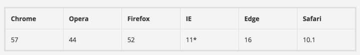
### 移动端/平板

## 重要术语
Grid Container
设置了 display: gird 的元素。 这是所有grid item的直接父项。 在下面的例子中，.container就是是 grid container。

```bash
<div class="container">
  <div class="item item-1"></div>
  <div class="item item-2"></div>
  <div class="item item-3"></div>
</div> 
```
Grid Item
Grid 容器的孩子（直接子元素）。下面的 .item 元素就是 grid item，但 .sub-item不是。

```bash
<div class="container">
  <div class="item"></div> 
  <div class="item">
    <p class="sub-item"></p>
  </div>
  <div class="item"></div>
</div>
```
Grid Line
这个分界线组成网格结构。 它们既可以是垂直的（“column grid lines”），也可以是水平的（“row grid lines”），并位于行或列的任一侧。 下面例中的黄线就是一个列网格线。
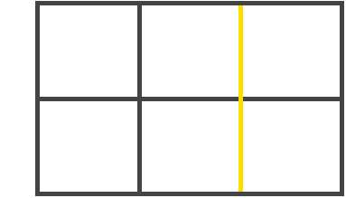
Grid Track
两个相邻网格线之间的空间。 你可以把它们想象成网格的列或行。 下面是第二行和第三行网格线之间的网格轨道。
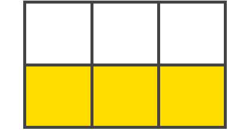
Grid Cell
两个相邻的行和两个相邻的列网格线之间的空间。它是网格的一个“单元”。 下面是行网格线1和2之间以及列网格线2和3的网格单元。
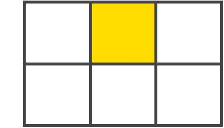
Grid Area
四个网格线包围的总空间。 网格区域可以由任意数量的网格单元组成。 下面是行网格线1和3以及列网格线1和3之间的网格区域。

## Grid 属性列表
Grid Container 的全部属性

```bash
display
grid-template-columns
grid-template-rows
grid-template-areas
grid-template
grid-column-gap
grid-row-gap
grid-gap
justify-items
align-items
justify-content
align-content
grid-auto-columns
grid-auto-rows
grid-auto-flow
grid
```

Grid Items 的全部属性

```bash
grid-column-start
grid-column-end
grid-row-start
grid-row-end
grid-column
grid-row
grid-area
justify-self
align-self
```
## 父容器(Grid Container)的属性
display
将元素定义为 grid contaienr，并为其内容建立新的网格格式化上下文(grid formatting context)。

值:

grid - 生成一个块级(block-level)网格
inline-grid - 生成一个行级(inline-level)网格
subgrid - 如果你的 grid container 本身就是一个 grid item（即,嵌套网格），你可以使用这个属性来表示你想从它的父节点获取它的行/列的大小，而不是指定它自己的大小。
```bash
.container {
  display: grid | inline-grid | subgrid;
}
```
注意：column, float, clear, 以及 vertical-align 对一个 grid container 没有影响

grid-template-columns / grid-template-rows
使用以空格分隔的多个值来定义网格的列和行。这些值表示轨道大小(track size)，它们之间的空格代表表格线(grid line)。

```bash
.container {
  grid-template-columns: <track-size> ... | <line-name> <track-size> ...;
  grid-template-rows: <track-size> ... | <line-name> <track-size> ...;
}
```
例子:

(如果未显示的给网格线命名)，轨道值之间仅仅有空格时，网格线会被自动分配数字名称：

```bash
.container {
  grid-template-columns: 40px 50px auto 50px 40px;
  grid-template-rows: 25% 100px auto;
}
```
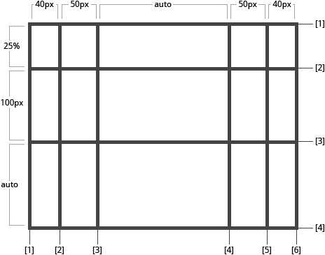
但你可以给网格线指定确切的命名。 注意中括号里的网格线命名语法：
```bash
.container {
  grid-template-columns: [first] 40px [line2] 50px [line3] auto [col4-start] 50px [five] 40px [end];
  grid-template-rows: [row1-start] 25% [row1-end] 100px [third-line] auto [last-line];
}
```
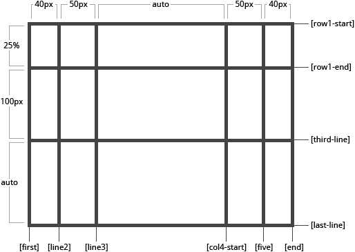
需要注意的是，一个网格线可以有不止一个名字。例如，这里第2条网格线有两个名字：row1-end 和 row2-start：

```bash
.container {
  grid-template-rows: [row1-start] 25% [row1-end row2-start] 25% [row2-end];
}
```
如果你的定义中包含重复的部分，则可以使用repeat() 符号来简化写法：

```bash
.container {
  grid-template-columns: repeat(3, 20px [col-start]) 5%;
}
```
上面的写法和下面等价：

```bash
.container {
  grid-template-columns: 20px [col-start] 20px [col-start] 20px [col-start] 5%;
}
```
“fr”单位允许您将轨道大小设置为网格容器自由空间的一部分。 例如，下面的代码会将每个 grid item 为 grid container 宽度的三分之一：

```bash
.container {
  grid-template-columns: 1fr 1fr 1fr;
}
```
自由空间是在排除所有不可伸缩的 grid item 之后计算得到的。 在下面的示例中，fr单位可用的自由空间总量不包括50px:

```bash
.container {
  grid-template-columns: 1fr 50px 1fr 1fr;
}
```
## grid-template-areas
通过引用 grid-area属性指定的网格区域的名称来定义网格模板。 重复网格区域的名称导致内容扩展到这些单元格。 点号表示一个空单元格。 语法本身提供了网格结构的可视化。

值：

<grid-area-name> - 使用 grid-area 属性设置的网格区域的名称
. - 点号代表一个空网格单元
none - 没有定义网格区域
举例：

```bash
.item-a {
    grid-area: header;
  }
  .item-b {
    grid-area: main;
  }
  .item-c {
    grid-area: sidebar;
  }
  .item-d {
    grid-area: footer;
  }
  
  .container {
    grid-template-columns: 50px 50px 50px 50px;
    grid-template-rows: auto;
    grid-template-areas: 
      "header header header header"
      "main main . sidebar"
      "footer footer footer footer";
  }
```
这将创建一个四列宽三行高的网格。 整个第一行将由 header 区域组成。 中间一行将由两个 main 区域、一个空单元格和一个 sidebar 区域组成。 最后一行是footer区域组成。
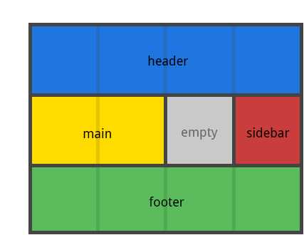
你的声明中的每一行都需要有相同数量的单元格。

您可以使用任意数量的相邻的.来声明单个空单元格。 只要这些点号之间没有空格，他们就代表了一个单一的单元格。

需要注意的是你不是在用这个语法命名网格线，而是在命名区域。 当你使用这种语法时，区域两端的网格线实际上是自动命名的。 比如，如果网格区域的名称是foo，那么区域的起始的行网格线和列网格线名称是 foo-start，并且区域终点的行网格线和列网格线名称是 foo-end。 这意味着某些网格线可能有多个名称，比如上面的例子中最左边的一条网格线有三个名字：header-start，main-start 和 footer-start。

grid-template
在单个声明中定义 grid-template-rows、grid-template-columns、grid-template-areas 的简写。

值：

none - 将三个属性都设置为其初始值
subgrid - 把 grid-template-rows 和 grid-template-columns 设置为 subgrid, 并且 grid-template-areas 设置为初始值
grid-template-rows / <grid-template-columns - 把 grid-template-columns 和 grid-template-rows 设置为指定值, 与此同时, 设置 grid-template-areas 为 none
.container {
  grid-template: none | subgrid | <grid-template-rows> / <grid-template-columns>;
}
它也可以使用一个更复杂但相当方便的语法来指定这三个值。 一个例子：

```bash
.container {
  grid-template:
    [row1-start] "header header header" 25px [row1-end]
    [row2-start] "footer footer footer" 25px [row2-end]
    / auto 50px auto;
}
```
以上等价于：

```bash
.container {
  grid-template-rows: [row1-start] 25px [row1-end row2-start] 25px [row2-end];
  grid-template-columns: auto 50px auto;
  grid-template-areas: 
    "header header header" 
    "footer footer footer";
}
```
由于 grid-template 不会重置隐式网格属性（grid-auto-columns，grid-auto-rows和grid-auto-flow），而这可能是大多数情况下你想要做的。因此建议使用grid属性来代替grid-template。

grid-column-gap / grid-row-gap
指定网格线的大小，你可以把它想象为设置列/行之间的间距的宽度。

值：

line-size - 一个长度值
```bash
.container {
  grid-column-gap: <line-size>;
  grid-row-gap: <line-size>;
}
```
举例：

```bash
.container {
  grid-template-columns: 100px 50px 100px;
  grid-template-rows: 80px auto 80px; 
  grid-column-gap: 10px;
  grid-row-gap: 15px;
}
```
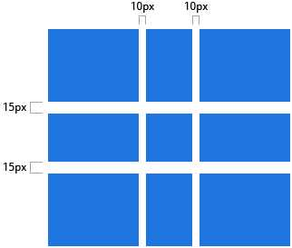
只能在列/行之间创建缝隙，而不是在外部边缘创建。

grid-gap
grid-row-gap 和 grid-column-gap 的缩写

```bash
.container {
  grid-gap: <grid-row-gap> <grid-column-gap>;
}
```
Example:

```bash
.container {
  grid-template-columns: 100px 50px 100px;
  grid-template-rows: 80px auto 80px; 
  grid-gap: 10px 15px;
}
```
如果没有指定 grid-row-gap，则会被设置为与 grid-column-gap 相同的值。

justify-items
沿着行轴对齐网格内的内容（与之对应的是 align-items, 即沿着列轴对齐），该值适用于容器内的所有的 grid items。

值：

start: 内容与网格区域的左端对齐
end: 内容与网格区域的右端对齐
center: 内容位于网格区域的中间位置
stretch: 内容宽度占据整个网格区域空间(这是默认值)
```bash
.container {
  justify-items: start | end | center | stretch;
}
```
举例：

```bash
.container {
  justify-items: start;
}
```
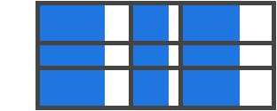
```bash
.container{
  justify-items: end;
}
```
```bash
.container {
  justify-items: center;
}
```
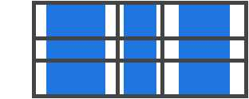
```bash
.container {
  justify-items: stretch;
}
```
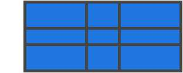
也可以通过给单个 grid item 设置justify-self属性来达到上述效果。

align-items
沿着列轴对齐grid item 里的内容（与之对应的是使用 justify-items 设置沿着行轴对齐），该值适用于容器内的所有 grid items。

值：

start: 内容与网格区域的顶端对齐
end: 内容与网格区域的底部对齐
center: 内容位于网格区域的垂直中心位置
stretch: 内容高度占据整个网格区域空间(这是默认值)
```bash
.container {
  align-items: start | end | center | stretch;
}
```
举例:

```bash
.container {
  align-items: start;
}
```
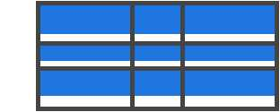
```bash
.container {
  align-items: end;
}
```
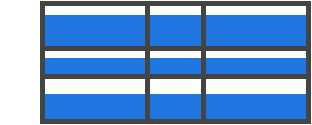
```bash
.container {
  align-items: center;
}
```
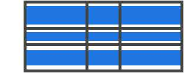
```bash
.container {
  align-items: stretch;
}
```

也可以通过给单个 grid item 设置align-self属性来达到上述效果。

justify-content
有时，网格的总大小可能小于其网格容器的大小。如果你的所有 grid items 都使用像px这样的非弹性单位来设置大小，则可能发生这种情况。此时，你可以设置网格容器内的网格的对齐方式。 此属性沿着行轴对齐网格（与之对应的是 align-content, 沿着列轴对齐）。

值：

start - 网格与网格容器的左边对齐
end - 网格与网格容器的右边对齐
center - 网格与网格容器的中间对齐
stretch - 调整g rid item 的大小，让宽度填充整个网格容器
space-around - 在 grid item 之间设置均等宽度的空白间隙，其外边缘间隙大小为中间空白间隙宽度的一半
space-between - 在 grid item 之间设置均等宽度空白间隙，其外边缘无间隙
space-evenly - 在每个 grid item 之间设置均等宽度的空白间隙，包括外边缘
```bash
.container {
  justify-content: start | end | center | stretch | space-around | space-between | space-evenly;  
}
```
举例：

```bash
.container {
  justify-content: start;
}
```
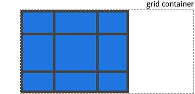
```bash
.container {
  justify-content: end; 
}
```
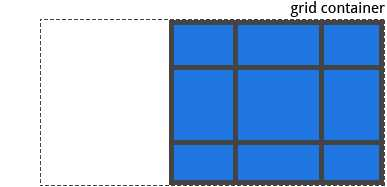
```bash
.container {
  justify-content: center;  
}
```
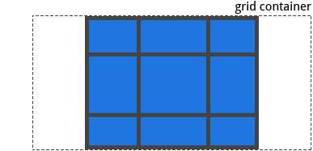
```bash
.container {
  justify-content: stretch; 
}
```
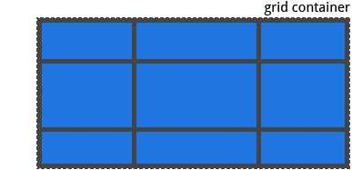
```bash
.container {
  justify-content: space-around;  
}
```
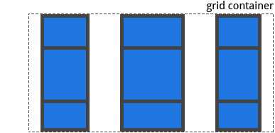
```bash
.container {
  justify-content: space-between; 
}
```
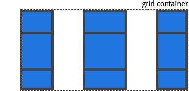
```bash
.container {
  justify-content: space-evenly;  
}
```
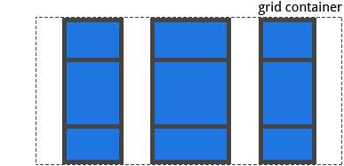
align-content
有时，网格的总大小可能小于其网格容器的大小。如果你的所有 grid items 都使用像px这样的非弹性单位来设置大小，则可能发生这种情况。此时，你可以设置网格容器内的网格的对齐方式。 此属性沿着列轴对齐网格（与之对应的是 justify-content, 即沿着行轴对齐）。

值：

start - 网格与网格容器的顶部对齐
end - 网格与网格容器的底部对齐
center - 网格与网格容器的中间对齐
stretch - 调整 grid item 的大小，让高度填充整个网格容器
space-around - 在 grid item 之间设置均等宽度的空白间隙，其外边缘间隙大小为中间空白间隙宽度的一半
space-between - 在 grid item 之间设置均等宽度空白间隙，其外边缘无间隙
space-evenly - 在每个 grid item 之间设置均等宽度的空白间隙，包括外边缘
```bash
.container {
  align-content: start | end | center | stretch | space-around | space-between | space-evenly;  
}
```
举例：

```bash
.container {
  align-content: start; 
}
```

```bash
.container {
  align-content: end; 
}
```
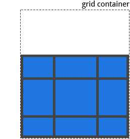
```bash
.container {
  align-content: center;  
}
```
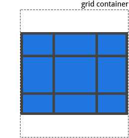
```bash
.container {
  align-content: stretch; 
}
```
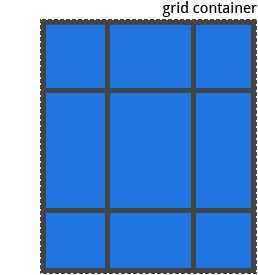
```bash
.container {
  align-content: space-around;  
}
```
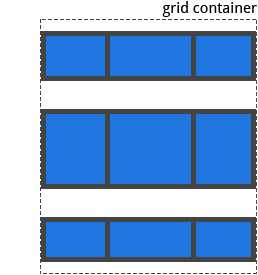
```bash
.container {
  align-content: space-between; 
}
```
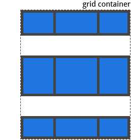
```bash
.container {
  align-content: space-evenly;  
}
```
！[](Grid布局/75773096.jpg)
grid-auto-columns / grid-auto-rows
指定自动生成的网格轨道（又名隐式网格轨道）的大小。 隐式网格轨道在你显式的定位超出指定网格范围的行或列（使用 grid-template-rows/grid-template-columns）时被创建。

值：

<track-size> - 可以是一个长度值，一个百分比值，或者一个自由空间的一部分（使用 fr 单位）

```bash
.container {
  grid-auto-columns: <track-size> ...;
  grid-auto-rows: <track-size> ...;
}
```
为了说明如何创建隐式网格轨道，思考如下代码：

```bash
.container {
  grid-template-columns: 60px 60px;
  grid-template-rows: 90px 90px
}
```
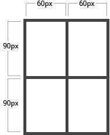
这里创建了一个 2x2的网格。

但是，现在想象一下，使用 grid-column 和 grid-row 来定位你的网格项目，如下所示：

```bash
.item-a {
  grid-column: 1 / 2;
  grid-row: 2 / 3;
}
.item-b {
  grid-column: 5 / 6;
  grid-row: 2 / 3;
}
```
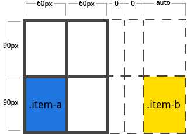
这里我们指定 .item-b开始于列网格线 5 并结束于在列网格线 6，但我们并未定义列网格线 5 或 6。因为我们引用不存在的网格线，宽度为0的隐式轨道的就会被创建用与填补间隙。我们可以使用 grid-auto-columns 和 grid-auto-rows属性来指定这些隐式轨道的宽度：

```bash
.container {
  grid-auto-columns: 60px;
}
```
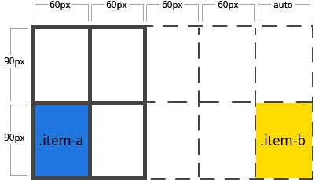
grid-auto-flow
如果你存在没有显示指明放置在网格上的 grid item，则自动放置算法会自动放置这些项目。 而该属性则用于控制自动布局算法的工作方式。

值：

row - 告诉自动布局算法依次填充每行，根据需要添加新行
column - 告诉自动布局算法依次填充每列，根据需要添加新列
dense - 告诉自动布局算法，如果后面出现较小的 grid item，则尝试在网格中填充空洞
```bash
.container {
  grid-auto-flow: row | column | row dense | column dense
}
```
需要注意的是，dense 可能导致您的 grid item 乱序。

举例， 考虑如下 HTML：

```bash
<section class="container">
  <div class="item-a">item-a</div>
  <div class="item-b">item-b</div>
  <div class="item-c">item-c</div>
  <div class="item-d">item-d</div>
  <div class="item-e">item-e</div>
</section>
```
你定义一个有5列和2行的网格，并将 grid-auto-flow 设置为 row（这也是默认值）：

```bash
.container {
  display: grid;
  grid-template-columns: 60px 60px 60px 60px 60px;
  grid-template-rows: 30px 30px;
  grid-auto-flow: row;
}
```
当把 grid item 放在网格上时，你只把其中两个设置了固定的位置：

```bash
.item-a {
  grid-column: 1;
  grid-row: 1 / 3;
}
.item-e {
  grid-column: 5;
  grid-row: 1 / 3;
}
```
因为我们将 grid-auto-flow 设置为row，所以我们的grid就像这样。 注意观察我们没有做设置的三个项目（item-b，item-c和item-d）是如何在剩余的行水平摆放位置的：
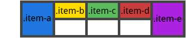
如果我们将 grid-auto-flow 设置为 column，则 item-b，item-c 和 item-d 以列的顺序上下摆放：
```bash
.container {
         display: grid;
         grid-template-columns: 60px 60px 60px 60px 60px;
         grid-template-rows: 30px 30px;
         grid-auto-flow: column;
       }

```
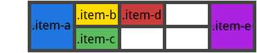
grid
在单个属性中设置所有以下属性的简写：grid-template-rows，grid-template-columns，grid-template-areas，grid-auto-rows，grid-auto-columns和grid-auto-flow。 它同时也将 sets grid-column-gap 和 grid-row-gap 设置为它们的初始值，即使它们不能被此属性显示设置。

值：

none - 将所有子属性设置为其初始值
<grid-template-rows> / <grid-template-columns> - 将 grid-template-rows 和 grid-template-columns 分别设置为指定值，将所有其他子属性设置为其初始值
<grid-auto-flow> [<grid-auto-rows> [ / <grid-auto-columns>] ] - 接受所有与grid-auto-flow，grid-auto-rows和grid-auto-columns相同的值。 如果省略grid-auto-columns，则将其设置为为grid-auto-rows指定的值。 如果两者都被省略，则它们被设置为它们的初始值
```bash
.container {
    grid: none | <grid-template-rows> / <grid-template-columns> | <grid-auto-flow> [<grid-auto-rows> [/ <grid-auto-columns>]];
}
```
举例：

以下代码写法等价

```bash
.container {
  grid: 200px auto / 1fr auto 1fr;
}
.container {
  grid-template-rows: 200px auto;
  grid-template-columns: 1fr auto 1fr;
  grid-template-areas: none;
}
```
以下代码写法等价

```bash
.container {
  grid: column 1fr / auto;
}
.container {
  grid-auto-flow: column;
  grid-auto-rows: 1fr;
  grid-auto-columns: auto;
}
```
它也可用使用一个更复杂但相当方便的语法来一次设置所有内容。 你可以指定 grid-template-areas、grid-template-rows 以及 grid-template-columns，并将所有其他子属性设置为其初始值。 你现在所做的是在其网格区域内，指定网格线名称和内联轨道大小。 可以看下面的例子：

```bash
.container {
  grid: [row1-start] "header header header" 1fr [row1-end]
        [row2-start] "footer footer footer" 25px [row2-end]
        / auto 50px auto;
}
```
上述代码等价于

```bash
.container {
  grid-template-areas: 
    "header header header"
    "footer footer footer";
  grid-template-rows: [row1-start] 1fr [row1-end row2-start] 25px [row2-end];
  grid-template-columns: auto 50px auto;    
}
```
孩子(Grid Items)的属性
grid-column-start / grid-column-end / grid-row-start /grid-row-end
使用特定的网格线确定 grid item 在网格内的位置。grid-column-start/grid-row-start 属性表示grid item的网格线的起始位置，grid-column-end/grid-row-end属性表示网格项的网格线的终止位置。

值：

<line>: 可以是一个数字来指代相应编号的网格线，也可使用名称指代相应命名的网格线
span <number>: 网格项将跨越指定数量的网格轨道
span <name>: 网格项将跨越一些轨道，直到碰到指定命名的网格线
auto: 自动布局， 或者自动跨越， 或者跨越一个默认的轨道
```bash
.item {
  grid-column-start: <number> | <name> | span <number> | span <name> | auto
  grid-column-end: <number> | <name> | span <number> | span <name> | auto
  grid-row-start: <number> | <name> | span <number> | span <name> | auto
  grid-row-end: <number> | <name> | span <number> | span <name> | auto
}
```
举例：

```bash
.item-a {
  grid-column-start: 2;
  grid-column-end: five;
  grid-row-start: row1-start
  grid-row-end: 3
}
```
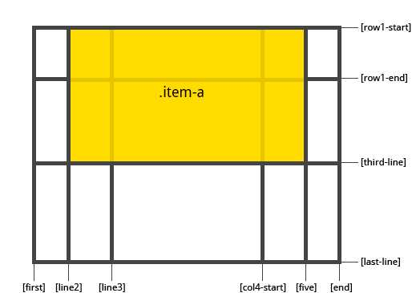
```bash
.item-b {
  grid-column-start: 1;
  grid-column-end: span col4-start;
  grid-row-start: 2
  grid-row-end: span 2
}
```
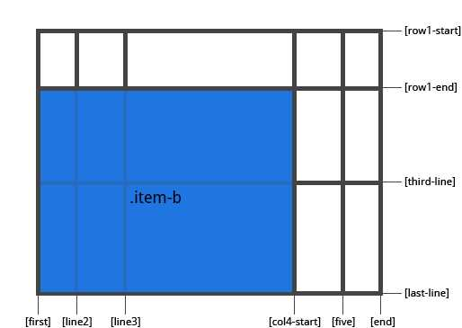
如果没有声明 grid-column-end / grid-row-end，默认情况下，该网格项将跨越1个轨道。

网格项可以相互重叠。 您可以使用z-index来控制它们的堆叠顺序。

grid-column / grid-row
grid-column-start + grid-column-end, 和 grid-row-start + grid-row-end 的简写形式。

值：

<start-line> / <end-line> - 每个值的用法都和属性分开写时的用法一样

```bash
.item {
  grid-column: <start-line> / <end-line> | <start-line> / span <value>;
  grid-row: <start-line> / <end-line> | <start-line> / span <value>;
}
```
举例：

```bash
.item-c {
  grid-column: 3 / span 2;
  grid-row: third-line / 4;
}
```
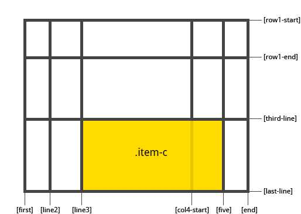
如果没有指定结束行值，则该网格项默认跨越1个轨道。

grid-area
给 grid item 进行命名以便于使用 grid-template-areas 属性创建模板时来进行引用。另外也可以做为 grid-row-start + grid-column-start + grid-row-end + grid-column-end 的简写形式。

值：

<name> - 你的命名
<row-start> / <column-start> / <row-end> /<column-end> - 可以是数字，也可以是网格线的名字

```bash
.item {
  grid-area: <name> | <row-start> / <column-start> / <row-end> / <column-end>;
}
```
举例:

给一个网格项命名

```bash
.item-d {
  grid-area: header
}
```
作为 grid-row-start + grid-column-start + grid-row-end + grid-column-end 的简写:

```bash
.item-d {
  grid-area: 1 / col4-start / last-line / 6
}
```
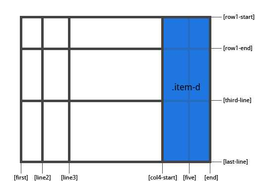
justify-self
沿着行轴对齐grid item 里的内容（与之对应的是 align-self, 即沿列轴对齐）。 此属性对单个网格项内的内容生效。

值：

start - 将内容对齐到网格区域的左端
end - 将内容对齐到网格区域的右端
center - 将内容对齐到网格区域的中间
stretch - 填充网格区域的宽度 (这是默认值)
举例：

```bash
.item-a {
  justify-self: start;
}
```
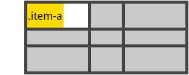
```bash
.item-a {
  justify-self: end;
}
```
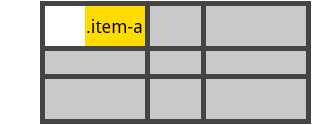
```bash
.item-a {
  justify-self: center;
}
```
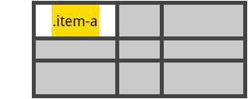
```bash
.item-a {
  justify-self: stretch;
}
```
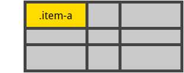
要为网格中的所有grid items 设置对齐方式，也可以通过 justify-items 属性在网格容器上设置此行为。

align-self
沿着列轴对齐grid item 里的内容（与之对应的是 justify-self, 即沿行轴对齐）。 此属性对单个网格项内的内容生效。

值：

start - 将内容对齐到网格区域的顶部
end - 将内容对齐到网格区域的底部
center - 将内容对齐到网格区域的中间
stretch - 填充网格区域的高度 (这是默认值)
```bash
.item {
  align-self: start | end | center | stretch;
}
```
举例:

```bash
.item-a {
  align-self: start;
}
```
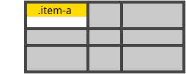
```bash
.item-a {
  align-self: end;
}
```
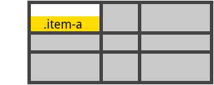
```bash
.item-a {
  align-self: center;
}
```
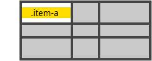
```bash
.item-a {
  align-self: stretch;
}
```
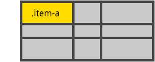
要为网格中的所有grid items 统一设置对齐方式，也可以通过 align-items 属性在网格容器上设置此行为。

参考：[CSS Grid 系列(上)-Grid布局完整指南](https://segmentfault.com/a/1190000012889793)