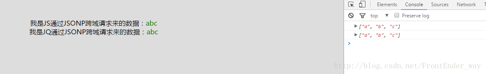

# 什么是跨域？

在了解跨域之前，首先要知道什么是同源策略（same-origin policy）。简单来讲同源策略就是浏览器为了保证用户信息的安全，防止恶意的网站窃取数据，禁止不同域之间的JS进行交互。对于浏览器而言只要域名、协议、端口其中一个不同就会引发同源策略，从而限制他们之间如下的交互行为：

Cookie、LocalStorage 和 IndexDB 无法读取。
DOM 无法获得。
AJAX 请求不能发送。

那么有时候我们又不得不去解决不同域之间的js交互，这时候就要解决浏览器同源策略的问题，也就是需要跨域。
跨域的解决办法

# 跨域的解决办法
## 一、JSONP
在js中，我们直接用XMLHttpRequest请求不同域上的数据时，是不可以的。但是，在页面上引入不同域上的js脚本文件却是可以的，script标签里的src属性来完成的，jsonp正是利用这个特性来实现的。 
比如，在桌面新建一个crossDomain.html页面，它里面的代码需要利用ajax获取一个不同域上的json数据，假设这个json数据地址是http://192.168.x.xxx/JSONP/jsonpTest.php那么crossDomain.html中的代码就可以这样：
```bash
<script type="text/javascript">
var text = document.querySelector('.text');
function dosomething(jsondata) {
    var str = "";
    for (var i = 0; i < jsondata.length; i++) {
        str += jsondata[i];
    }
    text.innerHTML = '我是JS通过JSONP跨域请求来的数据：'+'<span class="show">'+str+'</span>';
}
</script>
<script type="text/javascript" src="http://192.168.x.xxx/JSONP/jsonpTest.php?callback=dosomething"></script>
```
可以看到在获取数据的地址后面还有一个callback参数，按惯例是用这个参数名，但是你用其他的也一样。当然如果获取数据的jsonp地址页面不是你自己能控制的，就得按照提供数据的那一方的规定格式来操作了。
                                           因为是当做一个js文件来引入的，所以http://192.168.x.xxx/JSONP/jsonpTest.php返回的必须是一个能执行的js文件，所以这个页面的php代码可能是这样的:
   ```bash
   <?php                                                $callback = $_GET['callback'];//得到回掉函数名
      $data = array('a','b','c');//要返回的数据
      echo $callback.'('.json_encode($data).')'; 
      //输出
      ?>
   ```
   然后在crossDomain.html中打印出返回的jsondata如下：
                                           
   ```bash
   ["a", "b", "c"]
   ```
   可以看到请求成功了，然后就可以在crossDomain.html这个页面里处理这个数据了。 
   这样jsonp的原理就很清楚了，通过script标签引入一个js文件，这个js文件载入成功后会执行我们在url参数中指定的函数，并且会把我们需要的json数据作为参数传入。所以jsonp是需要服务器端的页面进行相应的配合的。 
   当然可以直接用一些已经封装过的库，这样就不用每次去创建script标签了。如下为JQ的跨域API：
   ```bash
   $.getJSON('http://192.168.x.xxx/JSONP/jsonpTest.php?callback=?',function(jsondata){
           console.log(jsondata);//["a", "b", "c"]
           var str = "";
           $.each(jsondata,function(i,index){
               return str += index;
           });
           $(".text1").html('我是JQ通过JSONP跨域请求来的数据：'+'<span class="show">'+str+'</span>');
       });
   ```
   jquery的getJSON方法会自动生成一个全局函数来替换callback=?中的问号，之后获取到数据后又会自动销毁，实际上就是起一个临时代理函数的作用。$.getJSON方法会自动判断是否跨域，不跨域的话，就调用普通的ajax方法；跨域的话，则会以异步加载js文件的形式来调用jsonp的回调函数。
   
##  二、通过修改document.domain来跨子域
   上面的jsonp是来解决ajax跨域请求的，那么如果是需要处理 Cookie 和 iframe 该怎么办呢？这时候就可以通过修改document.domain来跨子域。两个网页一级域名相同，只是二级域名不同，浏览器允许通过设置document.domain共享 Cookie或者处理iframe。比如A网页是http://w1.example.com/a.html，B网页是http://w2.example.com/b.html，那么只要设置相同的document.domain，两个网页就可以共享Cookie。
  ```bash
   document.domain = 'example.com';
     //现在，A网页通过脚本设置一个 Cookie。
     document.cookie = "test1=hello";
     //B网页就可以读到这个 Cookie。
     var allCookie = document.cookie;
   ```
   注意，这种方法只适用于 Cookie 和 iframe 窗口，LocalStorage 和 IndexDB 无法通过这种方法，规避同源政策，而要使用下文介绍的PostMessage API。 
   另外，服务器也可以在设置Cookie的时候，指定Cookie的所属域名为一级域名，比如.example.com。
   ```bash
   Set-Cookie: key=value; domain=.example.com; path=/
   //这样的话，二级域名和三级域名不用做任何设置，都可以读取这个Cookie。
   ```
   不同的iframe 之间（父子或同辈），是能够获取到彼此的window对象的，但是你却不能使用获取到的window对象的属性和方法(html5中的postMessage方法是一个例外，还有些浏览器比如ie6也可以使用top、parent等少数几个属性)，总之，你可以当做是只能获取到一个几乎无用的window对象。 
   首先说明一下同域之间的iframe是可以操作的。比如http://127.0.0.1/JSONP/a.html里面嵌入一个iframe指向http://127.0.0.1/myPHP/b.html。那么在a.html里面是可以操作iframe里面的DOM的。
 ```bash
 <iframe src="http://127.0.0.1/myPHP/b.html" frameborder="1"></iframe>
 <body>
 <script type="text/javascript">
 var iframe = document.querySelector("iframe");
 iframe.onload = function(){
     var win = iframe.contentWindow;
     var doc = win.document;
     var ele = doc.querySelector(".text1");
     var text = ele.innerHTML="123456";
 }
 </script>
 ```
 如果两个网页不同源，就无法拿到对方的DOM。典型的例子是iframe窗口和window.open方法打开的窗口，它们与父窗口无法通信。如果两个窗口一级域名相同，只是二级域名不同，那么document.domain属性，就可以规避同源政策，拿到DOM。 
 对于完全不同源的网站，目前有三种方法，可以解决跨域窗口的通信问题。
 
 片段识别符（fragment identifier）
 window.name
 跨文档通信API（Cross-document messaging）
 
 ##三、使用片段识别符来进行跨域
 片段标识符（fragment identifier）指的是，URL的#号后面的部分，比如http://example.com/x.html#fragment的#fragment。如果只是改变片段标识符，页面不会重新刷新。 
 父窗口可以把信息，写入子窗口的片段标识符。在父窗口写入：
 ```bash
 document.getElementById('frame').onload = function(){
     var src = "http://127.0.0.1/JSONP/b.html" + '#' + "data";
     this.src = src;
 }
 ```
 同样的，子窗口也可以改变父窗口的片段标识符。
 ```bash
 parent.location.href= target + "#" + hash;
 ```
 ## 四、使用window.name来进行跨域
 window对象有个name属性，该属性有个特征：即在一个窗口(window)的生命周期内,窗口载入的所有的页面都是共享一个window.name的，每个页面对window.name都有读写的权限，window.name是持久存在一个窗口载入过的所有页面中的，并不会因新页面的载入而进行重置。这个属性的最大特点是，无论是否同源，只要在同一个窗口里，前一个网页设置了这个属性，后一个网页可以读取它。 
 比如：有一个页面a.html,它里面有这样的代码：
 ```bash
 window.name = "我是a页面设置的";
 setTimeout(function(){
     window.location = "http://127.0.0.1/JSONP/b.html";
 },1000)
 ```
 b.html页面的代码：
 ```bash
 console.log(window.name);
 ``` 
a.html页面载入后1秒，跳转到了b.html页面，结果b页面打印出了：
```bash
我是a页面设置的
```
可以看到在b.html页面上成功获取到了它的上一个页面a.html给window.name设置的值。如果在之后所有载入的页面都没对window.name进行修改的话，那么所有这些页面获取到的window.name的值都是a.html页面设置的那个值。当然，如果有需要，其中的任何一个页面都可以对window.name的值进行修改。注意，window.name的值只能是字符串的形式，这个字符串的大小最大能允许2M左右甚至更大的一个容量，具体取决于不同的浏览器，但一般是够用了。 
利用window.name可以对同域或者不同域的之间的js进行交互。 
那么在a.html页面中，我们怎么把b.html页面载入进来呢？显然我们不能直接在a.html页面中通过改变window.location来载入b.html页面，因为我们想要即使a.html页面不跳转也能得到b.html里的数据。答案就是在a.html页面中使用一个隐藏的iframe来充当一个中间人角色，由iframe去获取b.html的数据，然后a.html再去得到iframe获取到的数据。

## 五、window.postMessage
上面两种方法都属于破解，HTML5为了解决这个问题，引入了一个全新的API：跨文档通信 API（Cross-document messaging）。 
这个API为window对象新增了一个window.postMessage方法，允许跨窗口通信，不论这两个窗口是否同源。目前IE8+、FireFox、Chrome、Opera等浏览器都已经支持window.postMessage方法。 
举例来说，父窗口http://a.com向子窗口http://b.com发消息，调用postMessage方法就可以了。 
a页面：  
```bash
<iframe id="frame1" src="http://127.0.0.1/JSONP/b.html" frameborder="1"></iframe>
document.getElementById('frame1').onload = function(){
    var win = document.getElementById('frame1').contentWindow;
    win.postMessage("我是来自a页面的","http://127.0.0.1/JSONP/b.html")
}
```  
b页面通过监听message事件可以接受到来自a页面的消息。
```bash
window.onmessage = function(e){
    e = e || event;
    console.log(e.data);//我是来自a页面的
}
```                                           
子窗口向父窗口发送消息的写法类似。
```bash
window.opener.postMessage('我是来自b页面的', 'http://a.com');
//父窗口和子窗口都可以通过message事件，监听对方的消息。
```                                           
通过window.postMessage，读写其他窗口的 LocalStorage 也成为了可能。 
下面是一个例子，主窗口写入iframe子窗口的localStorage。 
父窗口发送消息代码
```bash
var win = document.getElementsByTagName('iframe')[0].contentWindow;
var obj = { name: 'Jack' };
// 存入对象
win.postMessage(JSON.stringify({key: 'storage', method: 'set', data: obj}), 'http://b.com');
// 读取对象
win.postMessage(JSON.stringify({key: 'storage', method: "get"}), "*");
window.onmessage = function(e) {
  if (e.origin != 'http://a.com') return;
  // "Jack"
  console.log(JSON.parse(e.data).name);
};
```
子窗口接收消息的代码
```bash
window.onmessage = function(e) {
  if (e.origin !== 'http://bbb.com') return;
  var payload = JSON.parse(e.data);
  switch (payload.method) {
    case 'set':
      localStorage.setItem(payload.key, JSON.stringify(payload.data));
      break;
    case 'get':
      var parent = window.parent;
      var data = localStorage.getItem(payload.key);
      parent.postMessage(data, 'http://aaa.com');
      break;
    case 'remove':
      localStorage.removeItem(payload.key);
      break;
  }
};
```
## 六、通过WebSocket进行跨域
WebSocket是一种通信协议，使用ws://（非加密）和wss://（加密）作为协议前缀。该协议不实行同源政策，只要服务器支持，就可以通过它进行跨源通信。 
下面是一个例子，浏览器发出的WebSocket请求的头信息（摘自维基百科）。
```bash
GET /chat HTTP/1.1
Host: server.example.com
Upgrade: websocket
Connection: Upgrade
Sec-WebSocket-Key: x3JJHMbDL1EzLkh9GBhXDw==
Sec-WebSocket-Protocol: chat, superchat
Sec-WebSocket-Version: 13
Origin: http://example.com
```
上面代码中，有一个字段是Origin，表示该请求的请求源（origin），即发自哪个域名。 
正是因为有了Origin这个字段，所以WebSocket才没有实行同源政策。因为服务器可以根据这个字段，判断是否许可本次通信。如果该域名在白名单内，服务器就会做出如下回应。
```bash
HTTP/1.1 101 Switching Protocols
Upgrade: websocket
Connection: Upgrade
Sec-WebSocket-Accept: HSmrc0sMlYUkAGmm5OPpG2HaGWk=
Sec-WebSocket-Protocol: chat
```
## 七、 CORS
CORS是跨源资源分享（Cross-Origin Resource Sharing）的缩写。它是W3C标准，是跨源AJAX请求的根本解决方法。相比JSONP只能发GET请求，CORS允许任何类型的请求。CORS需要浏览器和服务器同时支持。目前，所有浏览器都支持该功能，IE浏览器不能低于IE10。 
整个CORS通信过程，都是浏览器自动完成，不需要用户参与。对于开发者来说，CORS通信与同源的AJAX通信没有差别，代码完全一样。浏览器一旦发现AJAX请求跨源，就会自动添加一些附加的头信息，有时还会多出一次附加的请求，但用户不会有感觉。 
因此，实现CORS通信的关键是服务器。只要服务器实现了CORS接口，就可以跨源通信。由于CORS涉及内容较多，以后会写一篇 专门介绍CORS的文章。

## 八、服务端设置代理页面专门处理前端跨域请求
总结：以上整理了各种常见的跨域解决办法，在开发过程中我们可以根据不同的场景选择最佳的解决办法。处理ajax的跨域可以选择JSONP、CORS，服务端设置代理、WebSocket。如果主域相同，处理多级子域之间的通信可以选择document.domain，处理不同域之间的iframe,子窗口可以选择window.name、window.postMessage、location.hash来解决。
本文参考:[浏览器同源政策及其规避方法](http://www.ruanyifeng.com/blog/2016/04/same-origin-policy.html )
[js中几种实用的跨域方法原理详解](https://my.oschina.net/u/3341316/blog/856682 )
[《js权威指南第六版》](https://www.javascriptcn.com/read-41.html)
[解决跨域汇总](http://blog.csdn.net/frontender_way/article/details/70568113)